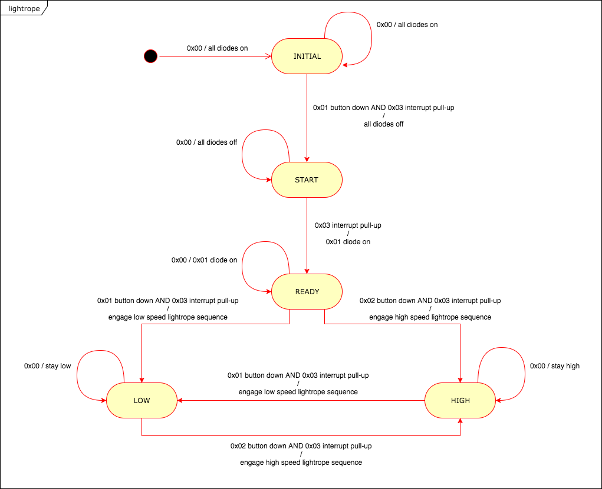

OBC R7018R HT2017
-----------------

- **Institution:** [Luleä University of Technology.](https://www.ltu.se/?l=en)
- **Programme:** [Master Programme of Spacecraft Design.](https://www.ltu.se/edu/program/TMRDA/TMRDA-Rymdfarkostdesign-master-1.83579?l=en)
- **Course:** [Spacecraft Onboard Datahandling.](https://www.ltu.se/edu/course/R70/R7018R/R7018R-Omborddatorer-for-rymdfarkoster-1.70129?kursplanId=34800&kursView=kursplan&l=en)
- **Assignment 2:** Tasks in [FreeRTOS.](http://www.freertos.org/)

### Goals
- To familiarize with the task concept.
- To familiarize with the FreeRTOS.
- To familiarize with the STK500 development board.
- To prepare for the final RTOS system lab.

### Resources
- [Assignment Instructions.](docs/Assignment 2 -Tasks in FreeRTOS.pdf)
- [Datasheet Atmega8.](docs/Datasheet Atmega8.pdf)
- [STK500 interrupts.](docs/STK500 interrupts.pdf)

### Task 3b State Diagram

